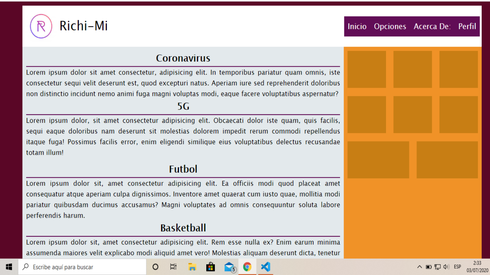

# Practica con Flexbox
**Flexbox al Contenedor Padre**
```CSS
display: flex | inline-flex;

flex-direction: row | column | row-reverse | column-reverse;
flex-wrap: wrap | nowrap | wrap-reverse;
flex-flow: row wrap;
justify-content: flex-start | flex-end | center | space-around | space-beetween | baseline; | filas
align-items: flex-end | flex-start | center; - columnas
align-content: flex-start | flex-end | center | space-around | space-beetween; | filas con wrap
```

**Flexbox a los contenedores hijos**
```CSS
flex-basis: 100px; 
flex-grow: 1;
flex-shirnk: 1;
flex: grow shirnk basis;
order: 1;
align-self: flex-end | flex-start | center | stretch | baseline;

```
